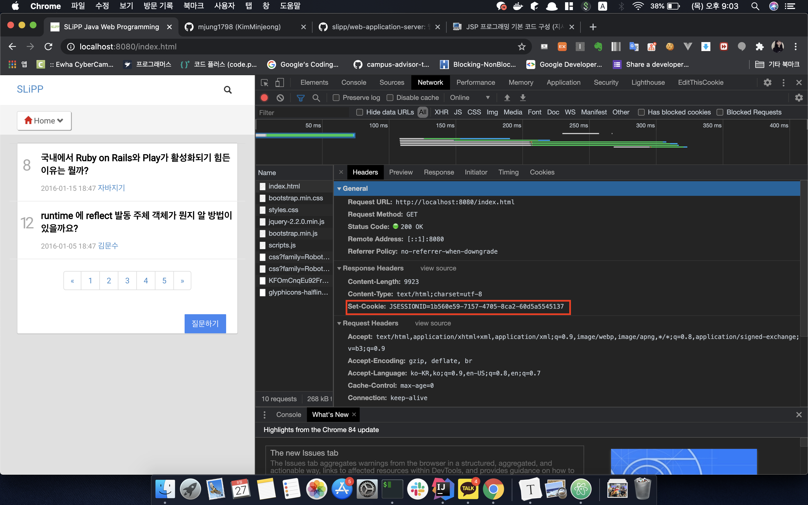

### JSP 사용시 주의점

인코딩 문제가 발생했었다. jsp 사용시 꼭 contentType을 추가해 주어야 한다.

```jsp
<%@ page contentType="text/html;charset=UTF-8" language="java" %>
```


### setCookie

```java
response.addHeader("Set-Cookie", "JSESSIONID="+UUID.randomUUID());
```

했을 때 실제로 브라우저(클라이언트)에서 Cookie가 설정되도록 Set-Cookie 설정



이후 새로고침 했을 때 RequestHeader에 Cookie가 들어가는지 확인


### MVC 패턴

- 클라이언트 요청이 처음 진입하는 부분이 컨트롤러이다. 
- JSP는 컨트롤러에서 전달한 데이터를 출력하는 로직만을 포함한다.
- MVC 패턴을 적용해 일관성 있는 코드를 구현하도록 강제가 가능하다.
- 중복 코드를 제거해 재사용성을 높일 수 있다.

**프레임워크** : 특정 패턴 기반으로 개발하도록 강제하는 역할

**라이브러리** : 패턴을 강제하는 부분이 없다.


### Servlet

```java
@WebServlet(name = "dispatcher", urlPatterns = "/", loadOnStartup = 1)
```

**dispatcherServlet** : 모든 클라이언트의 요청을 DispatcherServlet이 받고 나서 요청 URL에 따라 해당 컨트롤러에 작업을 위임한다.

``DispatcherServlet => RequestMapping => OOOController (extends Controller)``

이때 CSS, JS, image 에 대한 요청까지 dispatcherServlet에 걸리지 않도록 서블릿 필터를 추가하자 (ResourceFilter)


servlet은 브라우저에서 최초로 요청을 할 때 init() 메서드 실행후 메모리에 로드되어 기능을 수행한다 (최초 요청에 대한 실행 시간이 길어질 수 있다. => 이 단점 보완을 위한 것이 loadOnStartup)


**load-on-startup**

서블릿의 인스턴스를 생성하는 시점과 초기화를 담당하는 init() 메서드를 어느 시점에 호출할 것인지 결정한다.

> 설정하지 않으면 서블릿 인스턴스의 생성과 초기화가 서블릿 컨테이너의 시작 후 클라이언트 요청이 최초로 발생하는 시점에 진행

- 톰캣 컨테이너가 실행되면서 **미리** 서블릿을 실행
- 지정한 숫자가 0보타 크면 톰캣 컨테이너가 실행되면서 서블릿 초기화
- 지정 숫자는 우선순위를 의미한다 (작은 숫자부터 먼저 초기화)
- dispatcherServlet이 가장 먼저 요청을 받는 서블렛이므로 여기에 설정해 준다.


### dispatcherServlet

urlPatterns 를 / 으로 했을 때 와 /* 으로 했을 때 

```java
@WebServlet(name = "dispatcher", urlPatterns = "/", loadOnStartup = 1)
```

모든 요청 URL이 dispatcher servlet 으로 간다. 

> 이경우엔 localhost:8080/user/login.jsp 요청도 처리된다.

```java
@WebServlet(name = "dispatcher", urlPatterns = "/", loadOnStartup = 1)
```

모든 JSP에 대한 요청 또한 DispatcherServlet으로 연결된다. JSP에 대한 요청이 처리되지 않는다.

> localhost:8080/user/login.jsp 요청이 처리되지 않는다.


### DefaultServlet

"/" : 매핑되어있는 서블릿, JSP 요청이 아닌 자바스크립트, CSS, 이미지와 같은 요청을 처리하게 설계되었다. (정적자원 처리를 위한 서블릿)

ResourceFilter 에서 default 서블릿이 처리하게 구현하였다. DispatcherServlet으로 요청되기 이전에!

##### 주의점

HomeController 에 "/" 로 매핑 후 localhost:8080 요청을 하면?

HomeController가 아닌 index.jsp 로 요청이 간다. (path가 없는 경우 처리를 담당하는 기본 파일로 설정되어서) 따라서 필자는 HomeController에 "/" 매핑후 home.jsp 로 사용하였다고 한다.


### 프론트 컨트롤러 패턴(front controller pattern)

각 컨트롤러의 앞에 모든 요청을 받아 각 컨트롤러에 작업을 위임하는 방식으로 구현

>  requestMapper 로 해당하는 컨트롤러를 찾은 후 그 컨트롤러에 작업을 위임했음