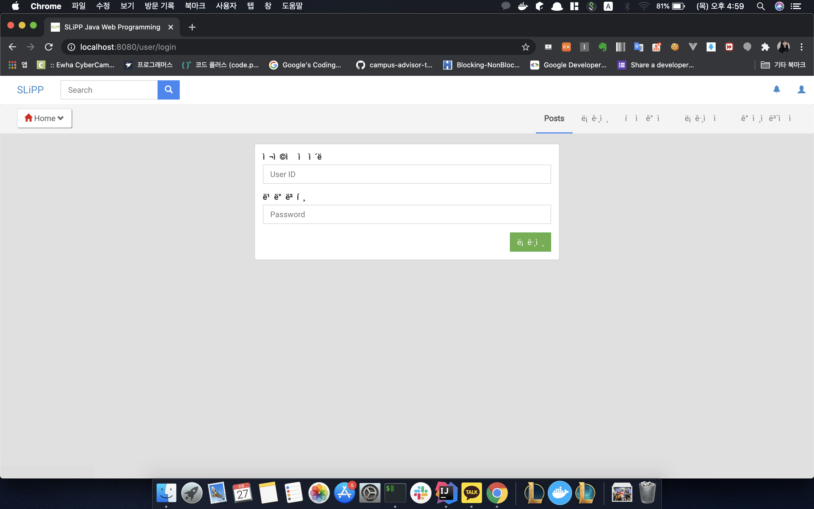
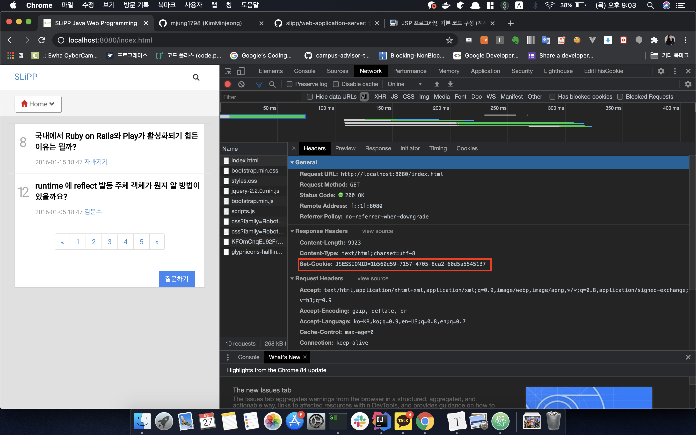
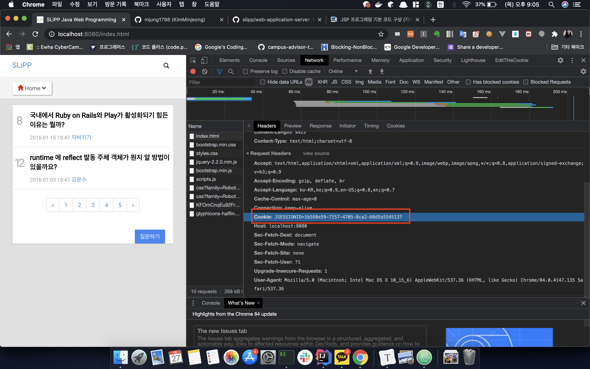

### JSP 사용시 주의점

인코딩 문제가 발생했었다. jsp 사용시 꼭 contentType을 추가해 주어야 한다.

```jsp
<%@ page contentType="text/html;charset=UTF-8" language="java" %>
```




### Session

JsessionId: tomcat servlet이 자동으로 클라이언트 요청이 들어올때 부여해준다. 그래서 내가 httpSession.add("user", value); 이렇게 했으니까 세션이 덮어씌워지는게 아닌가? 싶었는데 tomcat의 httpSession 자체에서 이미 클라이언트에 따른 JSESSIONID를 부여하기 때문에 개별적인 클라이언트로 인식한다. (상관없음!)

즉 tomcat의 httpSession은 직접구현했던 httpSession에 해당하고, 클라이언트 구분을 tomcat 내부에서 해주며 톰캣이 httpSessions 의 역할을 이미하고있는것이다.


### setCookie

```java
response.addHeader("Set-Cookie", "JSESSIONID="+UUID.randomUUID());
```

했을 때 실제로 브라우저(클라이언트)에서 Cookie가 설정되도록 Set-Cookie 설정



이후 새로고침 했을 때 RequestHeader에 Cookie가 들어가는지 확인




### MVC 패턴

- 클라이언트 요청이 처음 진입하는 부분이 컨트롤러이다. 
- JSP는 컨트롤러에서 전달한 데이터를 출력하는 로직만을 포함한다.
- MVC 패턴을 적용해 일관성 있는 코드를 구현하도록 강제가 가능하다.
- 중복 코드를 제거해 재사용성을 높일 수 있다.

**프레임워크** : 특정 패턴 기반으로 개발하도록 강제하는 역할

**라이브러리** : 패턴을 강제하는 부분이 없다.


### Servlet

```java
@WebServlet(name = "dispatcher", urlPatterns = "/", loadOnStartup = 1)
```

**dispatcherServlet** : 모든 클라이언트의 요청을 DispatcherServlet이 받고 나서 요청 URL에 따라 해당 컨트롤러에 작업을 위임한다.

``DispatcherServlet => RequestMapping => OOOController (extends Controller)``

이때 CSS, JS, image 에 대한 요청까지 dispatcherServlet에 걸리지 않도록 서블릿 필터를 추가하자 (ResourceFilter)


servlet은 브라우저에서 최초로 요청을 할 때 init() 메서드 실행후 메모리에 로드되어 기능을 수행한다 (최초 요청에 대한 실행 시간이 길어질 수 있다. => 이 단점 보완을 위한 것이 loadOnStartup)


**load-on-startup**

서블릿의 인스턴스를 생성하는 시점과 초기화를 담당하는 init() 메서드를 어느 시점에 호출할 것인지 결정한다.

> 설정하지 않으면 서블릿 인스턴스의 생성과 초기화가 서블릿 컨테이너의 시작 후 클라이언트 요청이 최초로 발생하는 시점에 진행

- 톰캣 컨테이너가 실행되면서 **미리** 서블릿을 실행
- 지정한 숫자가 0보타 크면 톰캣 컨테이너가 실행되면서 서블릿 초기화
- 지정 숫자는 우선순위를 의미한다 (작은 숫자부터 먼저 초기화)
- dispatcherServlet이 가장 먼저 요청을 받는 서블렛이므로 여기에 설정해 준다.


### dispatcherServlet

urlPatterns 를 / 으로 했을 때 와 /* 으로 했을 때 

```java
@WebServlet(name = "dispatcher", urlPatterns = "/", loadOnStartup = 1)
```

모든 요청 URL이 dispatcher servlet 으로 간다. 

> 이경우엔 localhost:8080/user/login.jsp 요청도 처리된다.

```java
@WebServlet(name = "dispatcher", urlPatterns = "/*", loadOnStartup = 1)
```

모든 JSP에 대한 요청 또한 DispatcherServlet으로 연결된다. JSP에 대한 요청이 처리되지 않는다.

> localhost:8080/user/login.jsp 요청이 처리되지 않는다.

"/" 일 때 필터에 있는 애들이면 dispatcher까지 안간다고 생각을 했었음 => "/*" 일때는 필터를 보지않고 dispatcher만 보는걸까?


### DefaultServlet

"/" : 매핑되어있는 서블릿, JSP 요청이 아닌 자바스크립트, CSS, 이미지와 같은 요청을 처리하게 설계되었다. (정적자원 처리를 위한 서블릿)

ResourceFilter 에서 default 서블릿이 처리하게 구현하였다. DispatcherServlet으로 요청되기 이전에!

##### 주의점

HomeController 에 "/" 로 매핑 후 localhost:8080 요청을 하면?

HomeController가 아닌 index.jsp 로 요청이 간다. (path가 없는 경우 처리를 담당하는 기본 파일로 설정되어서) 따라서 필자는 HomeController에 "/" 매핑후 home.jsp 로 사용하였다고 한다.


### 프론트 컨트롤러 패턴(front controller pattern)

각 컨트롤러의 앞에 모든 요청을 받아 각 컨트롤러에 작업을 위임하는 방식으로 구현

>  requestMapper 로 해당하는 컨트롤러를 찾은 후 그 컨트롤러에 작업을 위임했음


### ServletContextListener

``contextInitialized()`` : 초기화 작업 수행

- ContextLoaderListener가 ServletContextListener 인터페이스를 구현하고 있으며 @WebListener 애노테이션 설정이 있기 때문
- 서블릿 컨테이너를 시작하는 과정에서 contextInitilized() 메서드를 호출해 초기화 작업을 한다.
- 서블릿 초기화보다 ServletContextListener에 대한 초기화가 먼저 진행된다.


### Dao

Data Access Object

데이터베이스에 대한 접근 로직 처리를 담당하는 객체를 별도 분리


### JdbcTemplate 으로의 리팩토링 과정

1. Insert, Update 공통점 확인 : 변하는 부분과 변하지 않는 부분 extract method로 분리
   - Insert / setValueForInsert / createQueryForInsert
   - Update / setValueForUpdate / createQueryForUpdate
2. 공통 라이브러리로 구현할 코드를 새로운 클래스로 추가한 후 이동한다
   - InsertJdbcTemplate / UpdateJdbcTemplate
3. JdbcTemplate과 UserDao 사이 의존 관계를 끊는다. 
4. InsertJdbcTempate, UpdateJdbcTemplate의 공통부분을 합친다.
5. JdbcTemplate의 User와의 의존관계를 끊는다.
6. SelectJdbcTemplate 을 생성해 반복 코드를 분리한다.
   - query, queryForObject, setValues, mapRow
7. JdbcTemplate으로 합친다.
8. 문제점(setValues, maprow 두 메서드를 분리해 독립적으로 전달) -> 인터페이스로 분리
9. SQLException을 RuntimeException으로 분리한다
10. try-with-resource 문을 사용하여 close() 메서드를 사용하지 않고 해결한다.
11. 캐스팅 하지 않도록 로타입에서 제네릭으로 변환한다
12. 쿼리 전달 인자를 가변인자를 이용하여 변경한다
13. 람다식으로 interface 구현을 변경한다. 


### 브라우저가 HTML 응답을 받아 처리하는 과정

1. 브라우저가 HTML 응답을 받는다
2. 브라우저는 HTML을 라인 단위로 읽어내려가면서 서버에 재 요청이 필요한 부분을 찾아 서버에 재 요청을 보낸다 (CSS, JS, Image)
3. 서버에서 자원을 다운로드하면서 HTML DOM 트리를 구성한다.
4. 서버에서 CSS파일을 다운로드 하면 앞에서 생성한 HTML DOM 트리에 CSS 스타일을 적용한 후에 모니터화면에 그린다

**AJAX : Asynchronous Javascript and XML**

- 답변 추가 삭제에서 추가, 삭제되는 영역만 처리하면된다 (매번 서버에 요청을 보내는 과정을 생략한다)


### AJAX 처리 Controller 만들때 유의점

응답을 할 때 HTML이 아닌 JSON 형태의 데이터를 전달한다. (자바 객체를 JSON으로 사용하기 위해 Jackson 라이브러리를 사용한다.)

null 반환 : JSON 데이터를 생성한 후 바로 응답을 보내서 이동할 페이지가 없다


### 객체지향 설계로 깔끔한 코드 구현하기

경우의 수가 하나가 아닌 2개 이상이 발생하는 경우 

- if/else를 통해 해결하기 (X)
- interface를 이용해 해결하기 (O) => 확장가능하고 깔끔한 코드를 구현할 수 있다

인터페이스를 적용해 리팩토링할 부분이 있는지 찾아보자 :)


